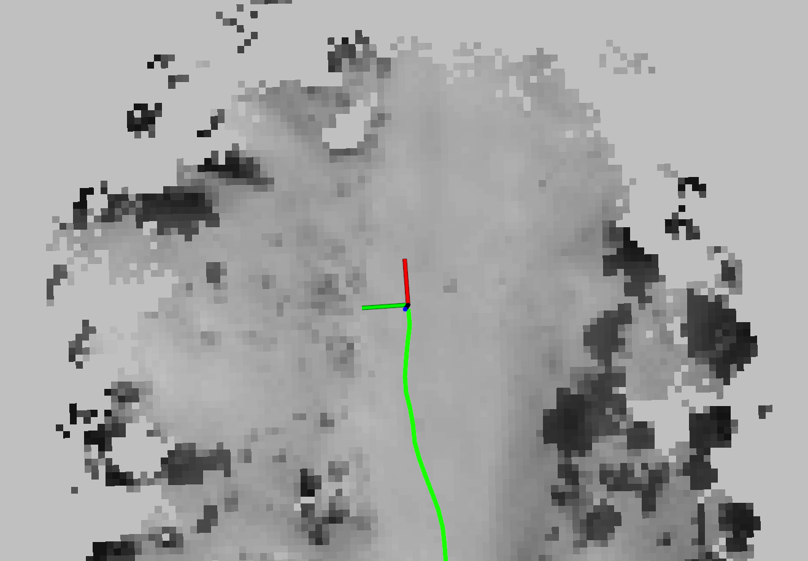
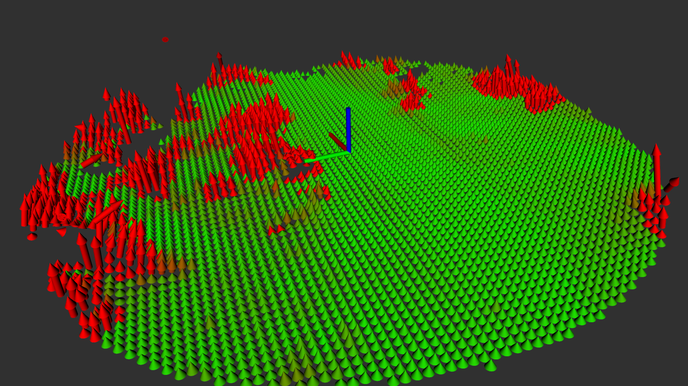

# PTS-Map
This is the official implementation of the paper:
"PTS-Map: Probabilistic Terrain State Map for Uncertainty-Aware Traversability Mapping in Unstructured Environments"


## Install
PTS-Map is built on a modified version of FAST-LIO2 (https://github.com/hku-mars/FAST_LIO), which we use to obtain the pose and gravitational vector from the IMU.
```
@article{xu2022fast,
  title={Fast-lio2: Fast direct lidar-inertial odometry},
  author={Xu, Wei and Cai, Yixi and He, Dongjiao and Lin, Jiarong and Zhang, Fu},
  journal={IEEE Transactions on Robotics},
  volume={38},
  number={4},
  pages={2053--2073},
  year={2022},
  publisher={IEEE}
}
```
Before building this package, you must first build livox_ros_driver (https://github.com/Livox-SDK/livox_ros_driver).
To set up the repository, follow the steps below:

```
cd ~/catkin_ws/src
git clone https://github.com/DongwookKim110/PTS-Map.git
cd ..
catkin_make -DCATKIN_WHITELIST_PACKAGES="livox_ros_driver"
catkin_make -DCATKIN_WHITELIST_PACKAGES=""
```

## Usage
We provide launch files configured for experiments using an Ouster LiDAR and an Xsens IMU.
If you are using your own robot, please update the following configuration files accordingly:
- LiDAR-IMU Configuration: Edit 'thirdpary/FAST_LIO/config/ouster.yaml' to align the topic names and sensor settings with your system.
```
common:
    lid_topic:  "/ouster/points"
    imu_topic:  "/imu/data"
preprocess:
    lidar_type: 3                # 1 for Livox serials LiDAR, 2 for Velodyne LiDAR, 3 for ouster LiDAR
    scan_line: 128
    scan_rate: 10                # only need to be set for velodyne, unit: Hz,
    timestamp_unit: 3  
mapping:
    extrinsic_T: [ 0.1, 0.0, 0.7] 
    extrinsic_R: [1, 0, 0,
                   0,1,0,
                  0,0,1]
```

- PTS-Map parameters: Update 'PTS_Map/config/params_ouster.yaml' to suit your robot's parameters.
```
# params for PTS-Map size
occ_width: 1000 # nav_msgs::occupancygrid width refers to x direction 
occ_height: 600 # nav_msgs::occupancygrid height refers to y direction
occ_origin_z: 0.0 # m, z offset for visualize the grid
occ_origin_x: -9.0 #-18.75 # -width*res*0.5 = center
grid_size: 0.15 # occ resolution

# params for input cropping
min_range: 0.9
max_range: 8.0 # 8.0
crop_z: 2.0 # 2.5 gravity aligned z-value upper crop

# params for above-ground elevation state updates
EHR_max_dist: 0.8 # robot's height + margin
EHR_min_dist: -0.1 # -margin
max_number_maintain: 100
temporal_gamma: 0.9

# params for cost
weights_coeff: [0.35, 0.5, 0.15] # slope, elevation, step
slope_thr: 25.0 # degree
elevation_thr: 0.4 # m
step_thr: 45.0 # degree -> tan(45) = 1
constraint_thr: 99.0 # 0 ~ 100
```

- To run PTS-Map, execute the following command (download short sample bag: https://drive.google.com/file/d/1xny8k7hyl1AGdl6xHZWzUFcsNVp4ODiB/view?usp=drive_link):
```
source devel/setup.bash
roslaunch pts_map run_ouster.launch
rosbag play sample.bag
```
<p align="center">
  
  
</p>

## Reference
If you use PTS-Map in your research, please cite the following:
```
@article{kim2024pts,
  title={PTS-Map: Probabilistic Terrain State Map for Uncertainty-Aware Traversability Mapping in Unstructured Environments},
  author={Kim, Dong-Wook and Son, E-In and Kim, Chan and Hwang, Ji-Hoon and Seo, Seung-Woo},
  journal={IEEE Robotics and Automation Letters},
  year={2024},
  publisher={IEEE}
}
```
